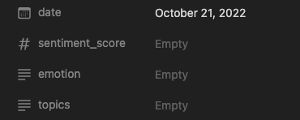
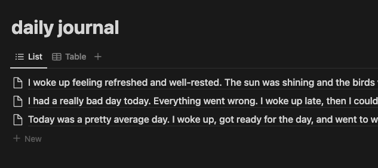
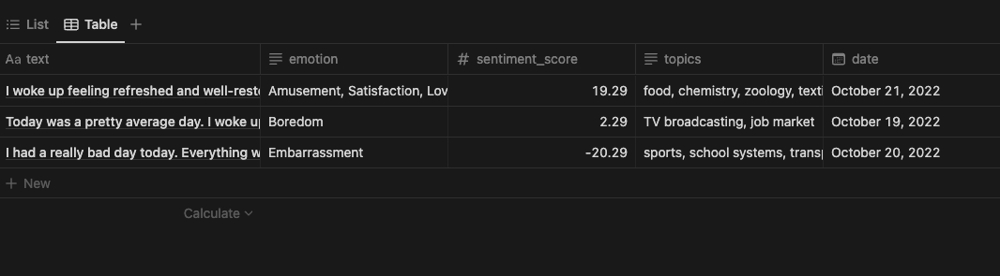
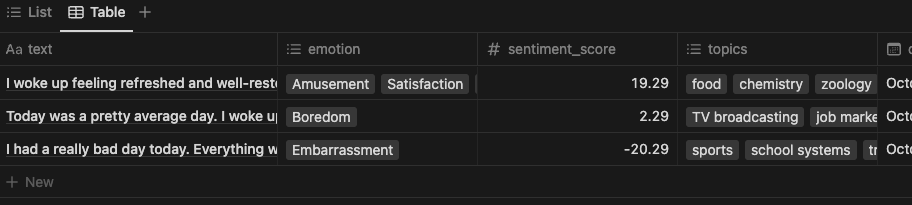

# Notion NLP Journal

Brining NLP to [notion.so](https://www.notion.so/)

Do you write your daily journal on Notion? This app automatically add sentiment analysis, keyword extraction, and emotional traits to your journal entries.

See this [live demo](https://benthecoder.notion.site/benthecoder/Sample-Journal-40fb7af2f66f4f3dbb9d49c43ffa3097) of a journal entry with NLP!

## Features


## Usage

### Step 1: Get credentials

Get your Notion Token and database ID for your journal page by following this [guide](https://developers.notion.com/docs/getting-started)

Sign up for a developer account with expert.ai and save your username and password.

Save replace the placeholders with your credentials in `.env.example` file.

```txt
NOTION_TOKEN=<NOTION_TOKEN>
NOTION_DATABASE_ID=<YOUR_JOURNAL_DATABASE_ID>
EAI_USERNAME=<YOUR_USERNAME>
EAI_PASSWORD=<YOUR_PASSWORD>
```

Rename `.env.example` to `.env`

### Step 2: Setup your notion page

First, the page must have the following properties, note the spelling and capitalization must be exact.

- `sentiment_score` - # number
- `topics` - text
- `emotions` - text

Below is an image of the properties



Next, make sure the journal entries have to be the title of the pages.



Here we have sample entries generated by [texti.app](https://texti.app/)

### step 3: Run locally

Create Conda environment

```shell
conda env create -n notion-nlp python=3.8
```

Activate the environment

```shell
conda activate notion-nlp
```

Install requirements

```shell
pip install -r requirements.txt
```

run the script

```shell
python main.py --all
```

You should see that your journal entires are now enriched with sentiment, topics and emotions like below



Tip: you can turn those topics and emotions into tags by switching it's property to `multi_select`



However, note that to use the github workflows feature, where nlp sentiments are added to your notion page automatically, you need to keep it as a text property.

## References

### libraries

- [therealexpertai/nlapi-python: Python Client for the expert.ai Natural Language API](https://github.com/therealexpertai/nlapi-python)
- [ramnes/notion-sdk-py: Official Notion SDK rewritten in Python](https://github.com/ramnes/notion-sdk-py)

### Docs

- [expert.ai Natural Language API](https://docs.expert.ai/nlapi/latest/)
- [Notion API](https://developers.notion.com/reference/intro)

### Try the api live

- [topics](https://try.expert.ai/document-analysis/relevants)
- [emotional traits](https://try.expert.ai/document-classification/emotional-traits/results)
- [Sentiment analysis](https://try.expert.ai/document-analysis/sentiment)

## Todo

- [ ] Add tests
- [ ] Save api call results in MongoDB
- [ ] Build a streamlit app that visualizes knowledge graph of journal entries
