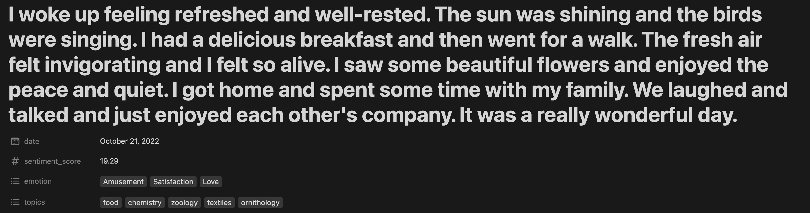

# Notion NLP Journal

Bringing NLP to [notion.so](https://www.notion.so/) with [expert.ai](https://www.expert.ai/).

Do you write your daily journal on Notion?

This app automatically add sentiment analysis, keyword extraction, and emotional traits to your journal entries.

See this [live demo](https://benthecoder.notion.site/benthecoder/Sample-Journal-40fb7af2f66f4f3dbb9d49c43ffa3097) of a journal entry with NLP!

## Features

The main features of this app are:

- Sentiment analysis: score from -100 to 100
- Emotional traits: see list of emotions [here](https://docs.expert.ai/nlapi/latest/reference/categories/#emotional-traits-taxonomy)
- Topic extraction: see list of topics [here](https://docs.expert.ai/nlapi/latest/reference/topics/)
- Automatic updates for new journal entries with Github Actions

Below is a sample entry of a bad day generated by [texti.app](https://texti.app/)


And here's a good day



### Limitations

Here are a couple of limitations of this app:

- journal entries must be in title
- properties must be created beforehand and must match spelling and capitalization, as well as property type
- keyword extraction is not great, some of them don't make sense

## Usage

### Step 1: Get credentials

Get your Notion Token and database ID for your journal page by following this [guide](https://developers.notion.com/docs/getting-started)

Sign up for a developer account with expert.ai and save your username and password.

Save replace the placeholders with your credentials in `.env.example` file.

```txt
NOTION_TOKEN=<NOTION_TOKEN>
NOTION_DATABASE_ID=<YOUR_JOURNAL_DATABASE_ID>
EAI_USERNAME=<YOUR_USERNAME>
EAI_PASSWORD=<YOUR_PASSWORD>
```

Rename `.env.example` to `.env`

### Step 2: Setup your notion page

First, the page must have the following properties, note the spelling and capitalization must be exact.

- `date` - Date
- `sentiment_score` - # number
- `topics` - text
- `emotions` - text

Below is an image of the properties


Next, make sure the journal entries have to be the title of the pages.


### step 3: Run locally

Create Conda environment

```shell
conda env create -n notion-nlp python=3.8
```

Activate the environment

```shell
conda activate notion-nlp
```

Install requirements

```shell
pip install -r requirements.txt
```

run the script

```shell
python main.py --all
```

You should see that your journal entires are now enriched with sentiment, topics and emotions like below


Tip: you can turn those topics and emotions into tags by switching it's property to `multi_select`


However, note that to add NLP info to future journal entries, you need to keep it as a text property.

### step 4: setup Github Workflows (optional)

add the secrets from `.env` to your repo by going to Settings > Secrets > Actions > New repository secret

## setup dev environment

```shell
pip install -r requirements-dev.txt
```

## run pre-commit

```shell
pre-commit run --all-files
```

## References

### libraries

- [therealexpertai/nlapi-python: Python Client for the expert.ai Natural Language API](https://github.com/therealexpertai/nlapi-python)
- [ramnes/notion-sdk-py: Official Notion SDK rewritten in Python](https://github.com/ramnes/notion-sdk-py)

### Docs

- [expert.ai Natural Language API](https://docs.expert.ai/nlapi/latest/)
  - [sentiment](https://docs.expert.ai/nlapi/latest/guide/sentiment-analysis/)
  - [topic](https://docs.expert.ai/nlapi/latest/guide/keyphrase-extraction/)
  - [emotional traits](https://docs.expert.ai/nlapi/latest/guide/classification/emotional-traits/)
- [Notion API](https://developers.notion.com/reference/intro)

### Try the api live

- [topics](https://try.expert.ai/document-analysis/relevants)
- [emotional traits](https://try.expert.ai/document-classification/emotional-traits/results)
- [Sentiment analysis](https://try.expert.ai/document-analysis/sentiment)

## Todo

- [ ] Add tests
- [ ] Save api call results in MongoDB
- [ ] Build a streamlit app that visualizes knowledge graph of journal entries
